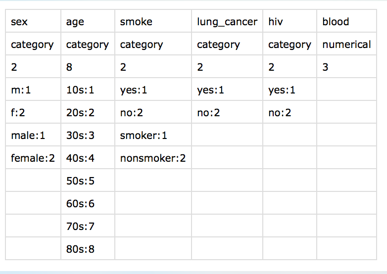

Crytographically Secure Statistical Data Analysis (CODA)
==
CODA is built for doing secure outsourcing, specifically for the computation of statistics.
The statistics supported by CODA:

* Mean/Variance/Covariance
* Histogram
* Contingency table (cell-suppression supported)
* Percentile
* Principle component analysis
* Linear regression

This is project is based on this [paper](https://www.internetsociety.org/doc/using-fully-homomorphic-encryption-statistical-analysis-categorical-ordinal-and-numerical-data).

## Outline of CODA

In CODA, we have three stakeholders: analyst, data contributor, cloud server.

**Analyst** is an entity that

* generates homomorphic key-pair (e.g., public encryption key and private decryption key) and distributes the public key to the data contributor;
* aims to conduct statistical analysis based on the data collected from data contributors.

**Data contributor** is an entity that

* privately holds data. For instance, hospital that holds patients' medical records which are sensitve data and needed to be kept privately;
* encrypts the private data using the public key generated by the analyst;
* sends the ciphertexts to the cloud server.

**Cloud server** is an entity that

* provdies computational resources and storage volume for computations;
* receives requests from the analyst and do the responding computation on ciphertexts that collected from the data contributors.

The work flows in CODA is as follows.

1. The analyst generates a key-pair using fully homomorphic encryption.
2. The analyst sends a request to the cloud server to open up a computing _session_, attached with a specification file (called meta file)
for describing data format, parameters etc.
3. The analyst sends his public encrytion key to the cloud server.
4. The data contributor sends a request to the cloud server to _join_ the analyst's session, and obtains the analyst's encryption key from the cloud.
5. The data contributor preprocesses and encrypts the data according to analyst's specification file.
6. The data contributor uploads the ciphertexts to the cloud.
7. When all the data contributors have uploaded the ciphertexts, the analyst sends a request to the cloud to start the homomorphic computation.
8. The cloud performs the computation and sends the resulting ciphertexts to the analyst.
9. The analyst decrypts the ciphertexts received from the cloud.

### Notice

* In advance, the analyst and data contributors should have some aggrements about the data, e.g., the precision of fixed-point values, 
    the ways of pre-processing the plain data.
* Since the analyst holds the decryption key, the data contributors need to trust the analyst and the cloud are collusion-free. In other words,
    the cloud server will not give the ciphertexts that collected from the data contributors to the analyst.
* We assume that the analyst knows how many data contributors will join his session.

## Installation
CODA leverages the [HElib](https://github.com/shaih/HElib) for fully homomorphic operations. 

*Requirements*

* Linux (g++ 4.9+) Mac OSX (llvm 6.1+) 
* cmake, make, perl, m4

*Build*

We provide a script `build.sh` for building CODA from scratch. The script will also ask you to set up the number of threads for multithreads programs (for Linux platform only).

## Components of CODA
In CODA, we have three executable components, _core_, _client_ and _server_. 
The _core_ mainly performs homomorphic operations including key generation, encryption, decryption and homomorphic computation etc.

The _client_ does the job for data contributors and the analyst. For instance, sending request to the cloud for opening or joining  a session; uploading or receving ciphertexts between the cloud.

The _server_ does the job on the cloud side. For example, listening the request from the clients.

These components are totall isolated and thus can work alone. To correctly join together, we have an aggrement between these three components: the directory structure. We are going to give some demo examplesto show the work flow of CODA and how these three components might work.

For instance, Alice (the analyst) opens a session (named SEC), and he is going to invite Bob and Clare to join his session. When Alice sends a request to the cloud server (by using the _client_ command), a directory will be created on the cloud side as follows.

```
Alice/
└── SEC
    ├── data
    ├── meta
    │   ├── meta.ini
    │   └── schema.csv
    ├── result
    ├── Bob 
    └── Clare
```
<!--TODO description for these folders -->

In the meantime, on Alice side, the _client_ command will create a working directory for Alice like
```
SEC/
├── data
│   ├── enc
│   │   ├── result
│   │   └── uploading
│   └── plain
│       ├── result
│       └── uploading
└── meta
    ├── meta.ini
    └── schema.csv
```
Folder `enc` holds the ciphertexts, including ciphertexts to be uploaded and ciphertexts that received from the cloud. Folder `plain` holds the plaintexts, including data to be encrypted, and decrypted result. Files `meta.ini` and `schema.csv` in folder `meta` are some meta inforamtion and will be discussed later.


Also, Alice can open more sessions. For instance, Alice opens a new session `SEC_2`. This time `Daniel` and `Ella` are invited. After Alice sending the second request to the cloud, the directory on the cloud side becomes 
```
Alice/
├── SEC
│   ├── data
│   ├── meta
│   │   ├── meta.ini
│   │   └── schema.csv
│   ├── result
│   ├── Bob
│   └── Clare
└── SEC_2
    ├── data
    ├── meta
    │   ├── meta.ini
    │   └── schema.csv
    ├── result
    ├── Daniel
    └── Ella
```

## Schema
In CODA, we leverage a schema file to specify howo to pre-process the data. Here is an example of the schema file.



We have 6 attributes here (5 categorical attributes, 1 numerical attributes). 
This schema file specify how we quantify these non-numerical values. Take the first attribute _sex_ as an example.
The 1st row `sex` is the label of this attribute. The 2nd row `category` indicates this is a categorical attribute.
The 3rd row `2` means this attribute can take two values, i.e., `male` and `female`. In this schema file, we encode the `male`
value as numerical value `1`, and encode the `female` value as value `2`. These converting rules are specifed in Row 4 to Row 7. Moreover, missing values and unknown values will be encoded as `0`. 

For numerical values, we need to specify the precision, because we use fixed-point values to represent real numbers.
The `3` in the `blood` column indicates that we preserve 3 digits for this attribute. More specifically, for a real value $x$ we convert to $\lceil x \times 10^3 \rfloor$.

## Usages
We start with the _server_ executable, which is run on the cloud side. 
We type `./server <port>` to setup a program for listening requests (on the specified port number) listen from the data contributors and analyst.
*Notice that*, the current directory will become a working directory, and thus _server_ will store the ciphertexts collected from the data contributors on
the working directory.

The _client_ executable is much functional. We type `./client` to see its usage:
```
Usage :
      : ./client init <session_name> <protocol> <schema_file_path> <user_name ...>
      : ./client send_key <session_name>
      : ./client join <hostname> <portno> <session_name> <analyst_name> <user_name>
      : ./client send_data <hostname> <portno> <session_name> <analyst_name> <user_name>
      : ./client receive_result <hostname> <portno> <session_name> <analyst_name>
      : ./client conv [-e] <session_name> <csv_data_file_path>
      : ./client conv [-d] <session_name> <result_file_path>
      : ./client d_net <hostname> <port_no>
```
The first five commands are basically the workflow described before. The last three commands are utility functions.
