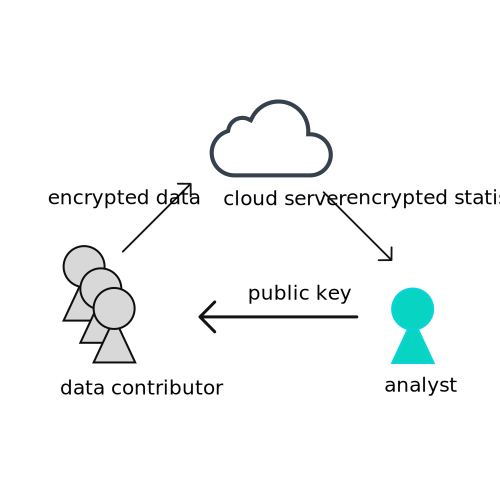

Crytographically secure of statistical Data Analysis (CODA)
==
CODA is built for doing secure outsourcing, specifically for the computation of statistics.
The statistics supported by CODA:

* Mean/Variance/Covariance
* Histogram
* Contingency table (cell-suppression supported)
* Percentile
* Principle component analysis
* Linear regression

## Outline

